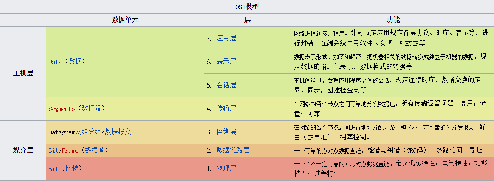

## nginx, remoteAddr, x-forwarded-for
HttpRequest请求在经过代理服务器之后获取到得客户端地址就是代理服务器的地址，对于Nginx，或者对于IP来说，这个地址都是无法改变的。  
因为Nginx工作在OSI参考模型的第七层，即应用层，IP地址是第三层网络层的东西，两者相互独立。  
 

 
来源：[中文维基](https://zh.wikipedia.org/wiki/OSI%E6%A8%A1%E5%9E%8B)  
 
一般来说有两个比较常用的方法  
- proxy-set-header X-Real-IP $remot_addr;  
- proxy-set-header X-Forwarded-For $proxy_add_x_forwarded_for;

*此处 `$remote_addr`是Nginx内置变量，指代这台Nginx之前的主机地址(如果是第二级代理，则是上级代理的地址，如127.0.0.1)。`X-Forwarded_For`已经成为HTTP扩展协议的一部分，被写进RFC 7239里，表明主流软件服务器都会支持它。`$proxy_add_x_forwarded_for` 变量的作用是把上级地址加入到`X-Forwarded-For`地址列表中。  
 
两种方法使用哪种都可以，第一种只能在最前面的代理服务器上设置，否则取不到真正的客户端IP。第二种地址列表中可能会有unknown的情况，所以最好判别一下。实际生产中会交叉判断，取决于代理服务器怎么设置。  
 
java示例代码：

    import java.util.*;
    import java.util.stream.Collectors;
    import org.apache.commons.collections4.CollectionUtils;
    import org.apache.commons.lang3.StringUtils;
    
    public static String getRemoteIP() {
        HttpServletRequest request = ((ServletRequestAttributes)RequestContextHolder.getRequestAttributes()).getRequest();
        String ip = request.getHeader("X-Forwarded-For");
        if (ip != null){
            String[] forwardedIp = ip.split(",");
            List<String> matchedIPString = Arrays.stream(forwardedIp).filter(StringUtil::isIPv4).collect(Collectors.toList());//java8
            if (CollectionUtils.isNotEmpty(matchedIPString)) {
                ip = matchedIPString.get(0);
            }
        }
        if (StringUtils.isEmpty(ip)) {
            String realIP = request.getHeader("X-Real-IP");
            ip = isIPv4(realIP) ? realIP : null;
        }
        if (StringUtils.isEmpty(ip)) {
            ip = request.getRemoteAddr();
        }
        return ip;
    }

    private static boolean isIPv4(String ip) {
        return ip.matches("(\\d{1,3}\\.){3}\\d{1,3}");
    }
 